# Soft Actor Critic (SAC)
## Overview 

This repository contains an implementation of Soft Actor-Critic (SAC), a state-of-the-art deep reinforcement learning algorithm designed for continuous control tasks. Originally proposed in the paper ["Soft Actor-Critic: Off-Policy Maximum Entropy Deep Reinforcement Learning with a Stochastic Actor" by Haarnoja et al](https://arxiv.org/abs/1801.01290), SAC enhances traditional actor-critic methods by integrating ideas from maximum entropy reinforcement learning and stochastic policies.  

SAC leverages the advantages of entropy regularization to promote exploration while maintaining a balance between exploration and exploitation. This is achieved through the incorporation of an entropy term in the objective function, encouraging policies to be both high-performing and diverse. The codebase has been evaluated on a variety of standard continuous control environments available in Gymnasium and MuJoCo libraries.

## Setup

### Required Dependencies

Install the required dependencies using the following command:

```bash
pip install -r requirements.txt
```

### Running the Algorithm

You can run the algorithm on any supported Gymnasium environment. For example:

```bash
python main.py --env 'LunarLanderContinuous-v2'
```

--- 

<table>
    <tr>
        <td>
            <p><b>Pendulum-v1</b></p>
            
        </td>
        <td>
            <p><b>LunarLanderContinuous-v2</b></p>
            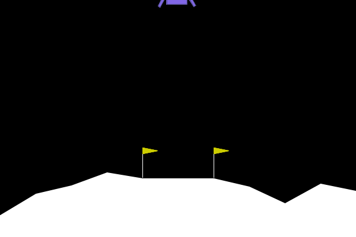
        </td>
        <td>
            <p><b>MountainCarContinuous-v0</b></p>
            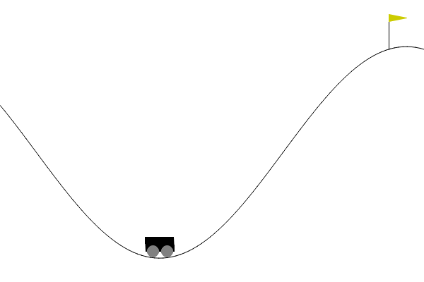
        </td>
    </tr>
    <tr>
        <td>
            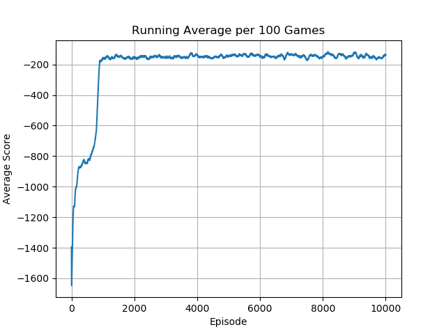
        </td>
        <td>
            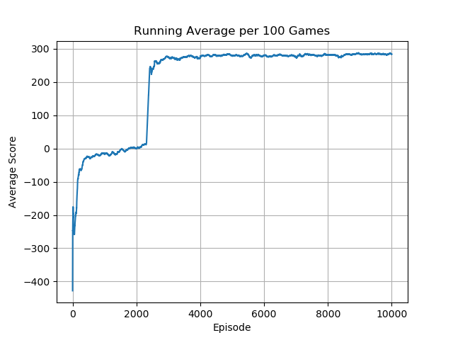
        </td>
        <td>
            
        </td>
    </tr>
</table>
<table>
    <tr>
        <td>
            <p><b>BipedalWalker-v3</b></p>
            
        </td>
        <td>
            <p><b>Hopper-v4</b></p>
            
        </td>
        <td>
            <p><b>Humanoid-v4</b></p>
            
        </td>
    </tr>
    <tr>
        <td>
            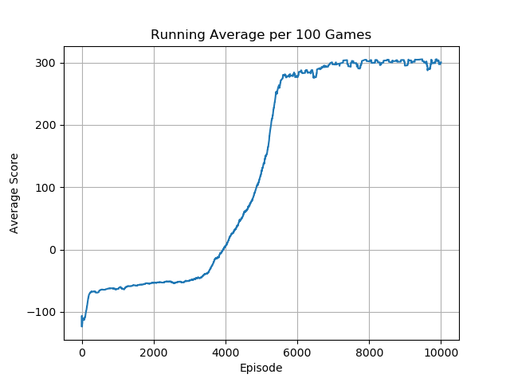
        </td>
        <td>
            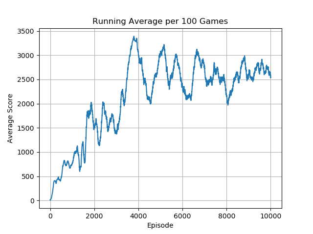
        </td>
        <td>
            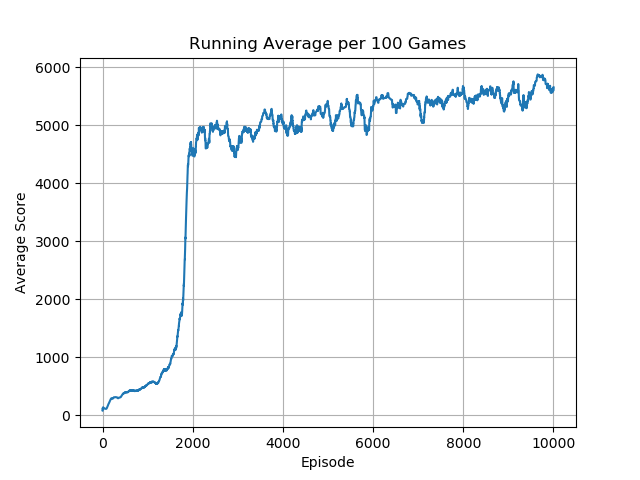
        </td>
    </tr>
</table>
<table>
    <tr>
        <td>
            <p><b>Ant-v4</b></p>
            
        </td>
        <td>
            <p><b>HalfCheetah-v4</b></p>
            
        </td>
        <td>
            <p><b>HumanoidStandup-v4</b></p>
            
        </td>
    </tr>
    <tr>
        <td>
            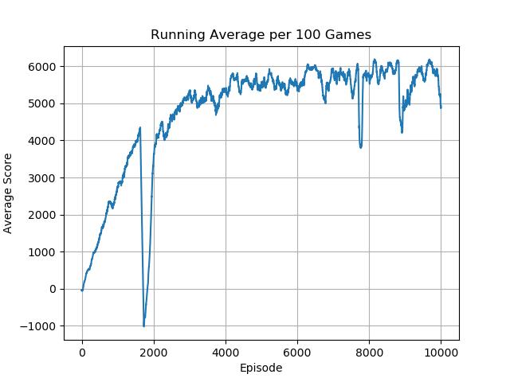
        </td>
        <td>
            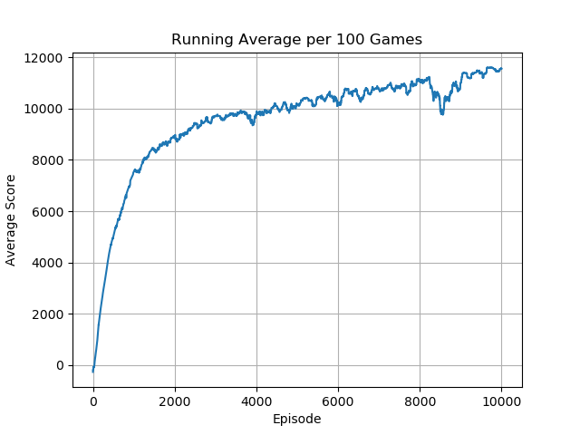
        </td>
        <td>
            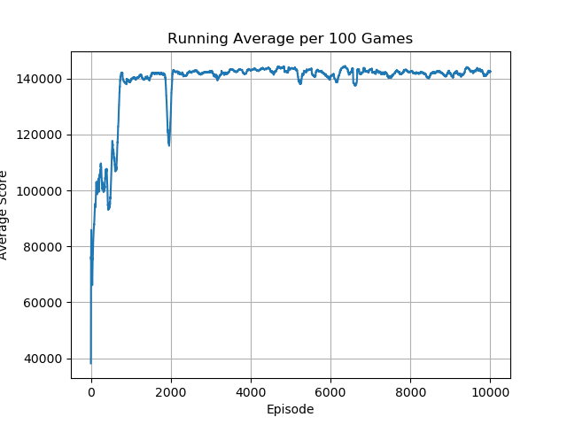
        </td>
    </tr>
</table>
<table>
    <tr>
        <td>
            <p><b>InvertedDoublePendulum-v4</b></p>
            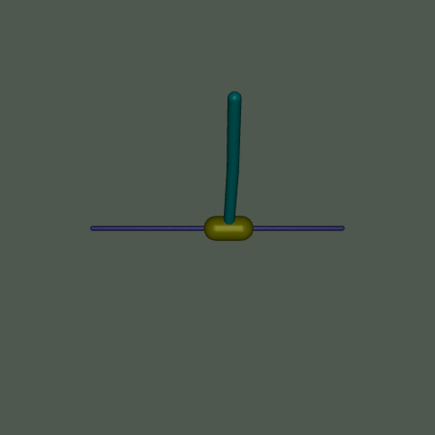
        </td>
        <td>
            <p><b>InvertedPendulum-v4</b></p>
            
        </td>
        <td>
            <p><b>Pusher-v4</b></p>
            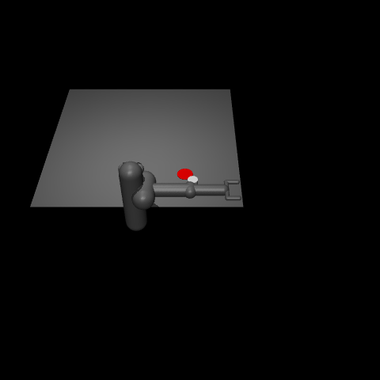
        </td>
    </tr>
    <tr>
        <td>
            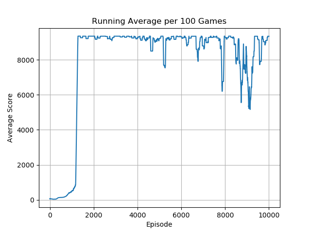
        </td>
        <td>
            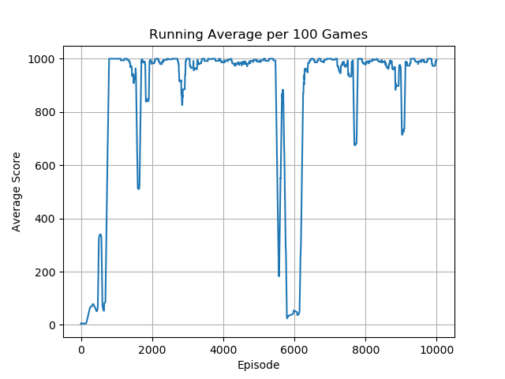
        </td>
        <td>
            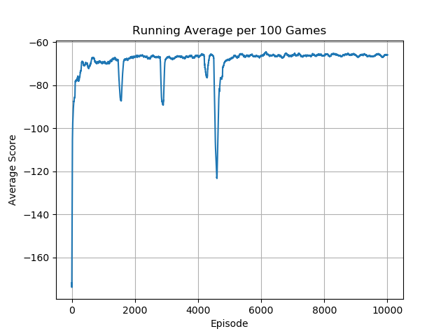
        </td>
    </tr>
</table>
<table>
    <tr>
        <td>
            <p><b>Reacher-v4</b></p>
            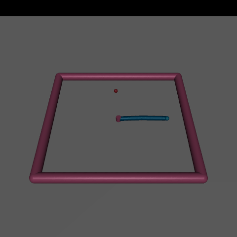
        </td>
        <td>
            <p><b>Swimmer-v3</b></p>
            
        </td>
        <td>
            <p><b>Walker2d-v4</b></p>
            
        </td>
    </tr>
    <tr>
        <td>
            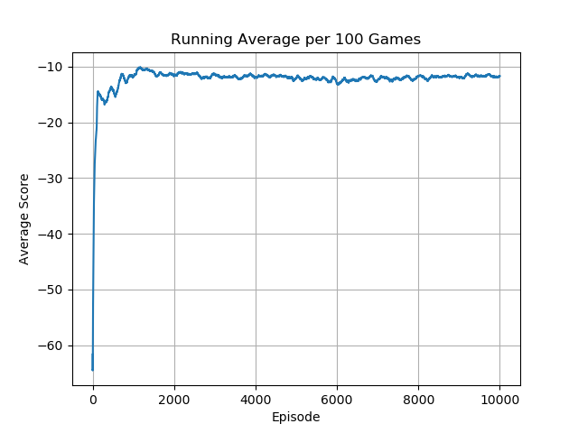
        </td>
        <td>
            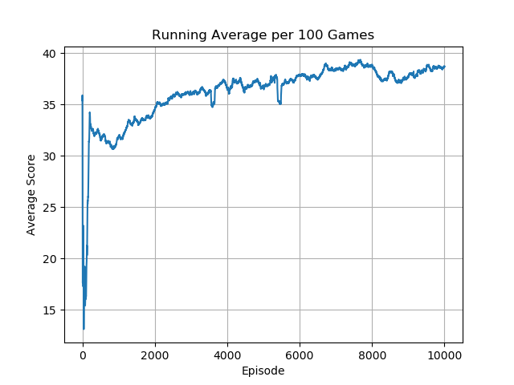
        </td>
        <td>
            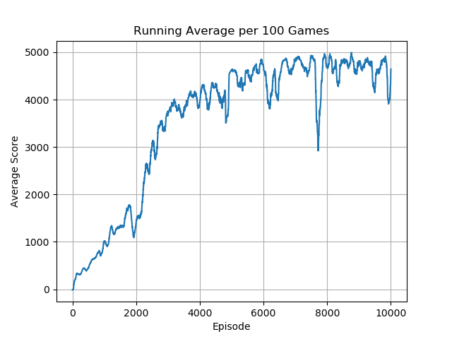
        </td>
    </tr>
</table>


## Acknowledgements

Special thanks to Phil Tabor, an excellent teacher! I highly recommend his [Youtube channel](https://www.youtube.com/machinelearningwithphil).