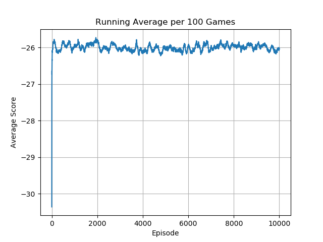

# Soft Actor Critic (SAC)
## Overview 

This repository contains an implementation of Soft Actor-Critic (SAC), a state-of-the-art deep reinforcement learning algorithm designed for continuous control tasks. Originally proposed in the paper ["Soft Actor-Critic: Off-Policy Maximum Entropy Deep Reinforcement Learning with a Stochastic Actor" by Haarnoja et al](https://arxiv.org/abs/1801.01290), SAC leverages the advantages of entropy regularization to promote exploration while maintaining a balance between exploration and exploitation. This is achieved through the incorporation of an entropy term in the objective function, encouraging policies to be both high-performing and diverse. The codebase has been evaluated on a variety of standard continuous control environments available in Gymnasium and MuJoCo libraries.

## Setup

### Required Dependencies

Install the required dependencies using the following command:

```bash
pip install -r requirements.txt
```

### Running the Algorithm

You can run the algorithm on any supported Gymnasium environment. For example:

```bash
python main.py --env 'LunarLanderContinuous-v2'
```

## Environments
No hyper-parameter tuning was performed for these benchmarks. This was an intentional strategy to compare the general performance of the algorithm across different kinds of tasks. As such, there are some examples where the agent failed to effectively learn, and others where the agent was still learning after 10k episodes.  

<table>
    <tr>
        <td>
            <p><b>Pendulum-v1</b></p>
            
        </td>
        <td>
            <p><b>LunarLanderContinuous-v2</b></p>
            
        </td>
        <td>
            <p><b>MountainCarContinuous-v0</b></p>
            
        </td>
    </tr>
    <tr>
        <td>
            
        </td>
        <td>
            
        </td>
        <td>
            
        </td>
    </tr>
</table>
<table>
    <tr>
        <td>
            <p><b>BipedalWalker-v3</b></p>
            
        </td>
        <td>
            <p><b>Hopper-v4</b></p>
            
        </td>
        <td>
            <p><b>Humanoid-v4</b></p>
            
        </td>
    </tr>
    <tr>
        <td>
            
        </td>
        <td>
            
        </td>
        <td>
            
        </td>
    </tr>
</table>
<table>
    <tr>
        <td>
            <p><b>Ant-v4</b></p>
            
        </td>
        <td>
            <p><b>HalfCheetah-v4</b></p>
            
        </td>
        <td>
            <p><b>HumanoidStandup-v4</b></p>
            
        </td>
    </tr>
    <tr>
        <td>
            
        </td>
        <td>
            
        </td>
        <td>
            
        </td>
    </tr>
</table>
<table>
    <tr>
        <td>
            <p><b>InvertedDoublePendulum-v4</b></p>
            
        </td>
        <td>
            <p><b>InvertedPendulum-v4</b></p>
            
        </td>
        <td>
            <p><b>Pusher-v4</b></p>
            
        </td>
    </tr>
    <tr>
        <td>
            
        </td>
        <td>
            
        </td>
        <td>
            
        </td>
    </tr>
</table>
<table>
    <tr>
        <td>
            <p><b>Reacher-v4</b></p>
            
        </td>
        <td>
            <p><b>Swimmer-v3</b></p>
            
        </td>
        <td>
            <p><b>Walker2d-v4</b></p>
            
        </td>
    </tr>
    <tr>
        <td>
            
        </td>
        <td>
            
        </td>
        <td>
            
        </td>
    </tr>
</table>

SAC significantly outperforms DDPG on a number of environments, notably succeeding in the BipedalWalker-v3 where DDPG failed to effectively learn. Perhaps most interesting, in my opinion, is the failure to learn the MountainCarContinuous environment; for all intents and purposes this is a much easier task, but due to the extremely sparse nature of the rewards it appears the SAC policy fails to regularly discover the reward state and propogate that information effectively. This could potentially be solved using something like prioritized experience replay to reinforce the effect of those reward states when they are encountered. 

One other consideration: SAC took much, much longer to train than DDPG (~7x) for the same set environments. This could be the result of a suboptimal implementation on my part (let's be honest, this is likely...) or simply the result of the algorithm being more successfull in general - in many environments a successful agent is allowed to operate for extended periods of time before reaching a terminal state.


## Acknowledgements

Special thanks to Phil Tabor, an excellent teacher! I highly recommend his [Youtube channel](https://www.youtube.com/machinelearningwithphil).